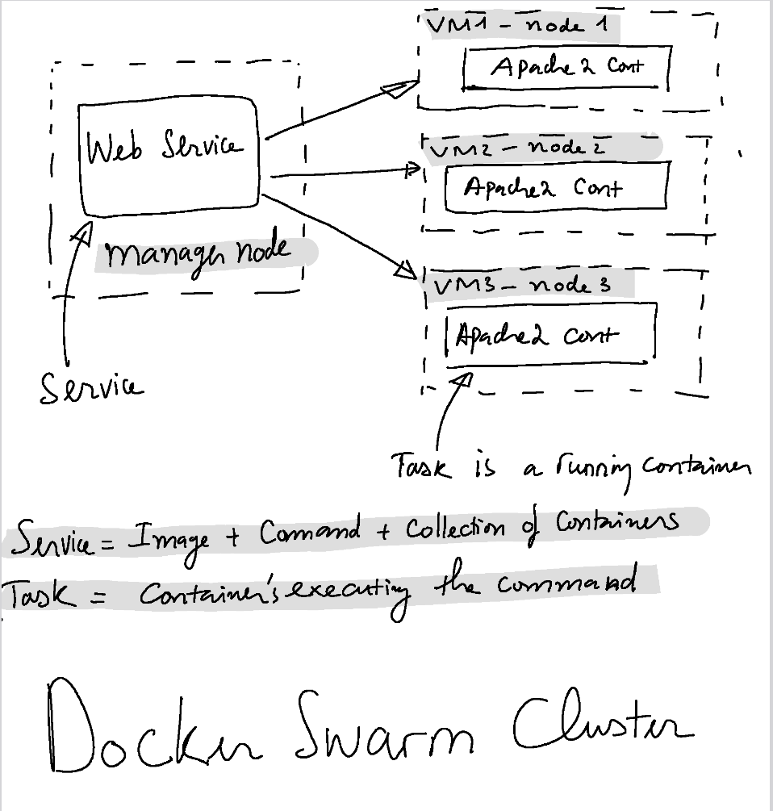

# Infrastructure as Code
### Run Vagrantfile to create for vm:  
```vagrant up```    
### Create docker swarm cluster:  
```ansible-playbook -i inventory create_cluster.yml```  
### Deploy the untergas/getting-started to the docker swarm:  
```ansible-playbook -i inventory deploy_service.yml```  

### Docker Swarm Cluster  

  

**Cluster**: group of either physical or virtual machines that are running the Docker application  

**Node**: either physical or vm inside the cluster  

**Manager node**: Receive Service from docker-compose and assign tasks to worker node  

**Worker node**: Do the task assigned by manager node  

**Service VS Task**: We want to deploy apache web "Service" with 3 replicas. The manager node will tell the worker nodes: "Hey let's build and run a apache container". the worker node then runs a container with apache image. The container that's running called "Task".  
```
Service = Image + Command to run + replicas  
Task = Container's executing the command
```
 
